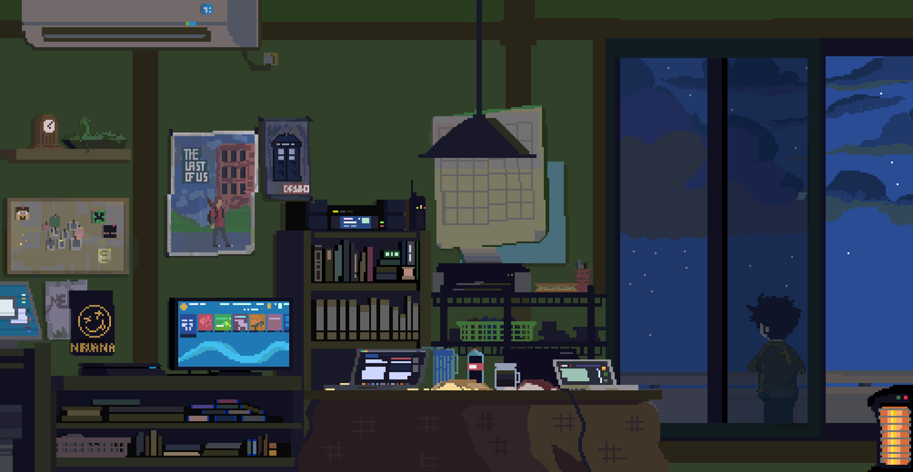

<h1 align='center'>Hi, I am Vishal Minj!😀</h1>
 

---
 

## About Me:
I'm a CS major student currently pursuing my master's degree from MNNIT Allahabad, Prayagraj. My primary tech stack is web development, and I'm currently 🌱 learning React ⚛ and Django 🐍.
My personal interests involve anime and digital illustration.

 

## 🌐 Socials:

 

 

## ⚒️ Languages-Frameworks-Tools:

    
     

